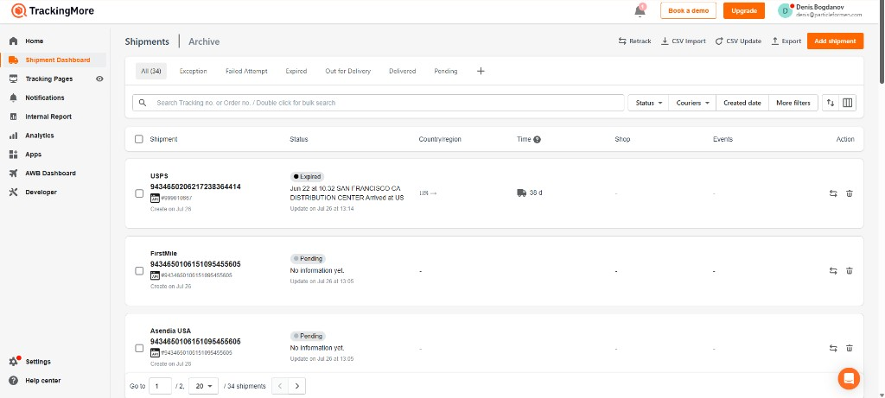
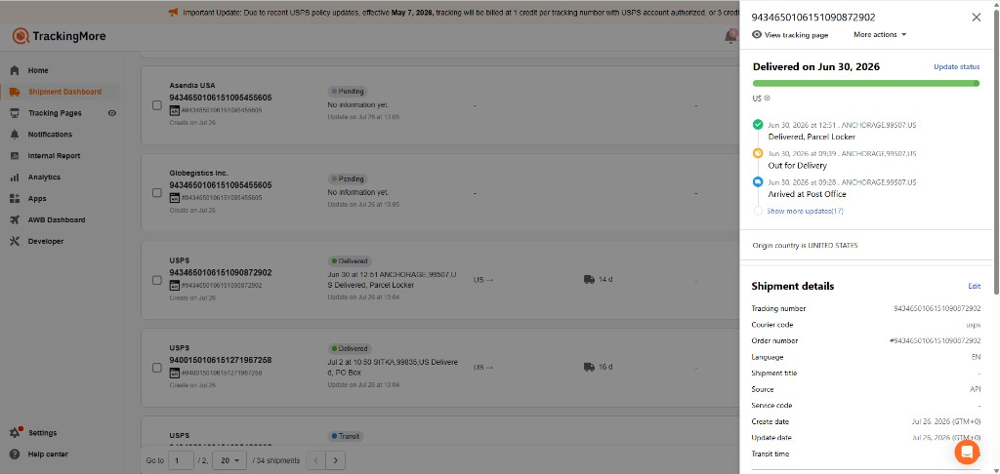

# Admin UI reference — TrackingMore-style

**Source:** TrackingMore Shipment Dashboard (screenshots captured for PFM tracking admin).  
**Intent:** Use this layout pattern for our Vue admin — not a pixel clone of TrackingMore branding, but the same interaction model.

## Screenshots

### 1. Shipments list

**Adopt:**

| Pattern | Detail |
| :--- | :--- |
| Left sidebar nav | Dashboard, Shipments, (later: Job runs, Status map, Users, Settings) |
| Status filter tabs | All / Exception / Failed Attempt / Out for Delivery / Delivered / Pending (+ our: Stalled, Cancelled) with live counts |
| Search | Single box: tracking no. **or** order no.; support bulk search |
| Filters | Status, Carrier/Courier, Created date, More filters |
| Row content | Carrier name, tracking number (bold), created date; status badge; **latest event text + location + time**; transit age; actions (retrack / sync) |
| Toolbar | Retrack, Export; primary “Add” only if we need manual entry later (not required for v1) |
| Pagination | Page size 20/50/100 |

### 2. Shipment detail slide-over

**Adopt:**

| Pattern | Detail |
| :--- | :--- |
| Right-hand slide-over | Opens over the list; list stays visible behind (dimmed) |
| Header | Tracking number, order number, “View tracking page” (opens our public `/t/:token`), More actions |
| Status summary | Big status line + progress bar driven by `status_rank` |
| Timeline | Newest events with timestamp + location + description; “Show more updates (N)” |
| Shipment details block | Tracking #, carrier code/display, order #, source (`shipbob` / `klb`), created/updated, aggregator id if TrackingMore |
| Actions | Re-sync from source, TrackingMore retrack, copy customer link, replay Klaviyo (Phase 3) |

## Map to our data

| UI element | Our field / source |
| :--- | :--- |
| Tracking number | `shipments.tracking_number` |
| Carrier | `carriers.display_name` ← ShipBob/TrackingMore carrier string |
| Status badge | `shipments.internal_status` (+ separate **Stalled** chip if `is_stalled`) |
| Latest event line | newest `tracking_events` description + location + `occurred_at` |
| Progress bar | `status_rank` from status set in `docs/dev-plan.md` §4 |
| Timeline | `tracking_events` for that `shipment_id` |
| View tracking page | public URL with order `public_token` |
| Source | `shipments.source` badge (`shipbob` / `klb`) instead of TrackingMore’s “API” chip |

## Explicit differences from TrackingMore

- We are **order-aware**: also need an Orders view / order slide-over with nested parcels (TrackingMore is shipment-only).
- **Stalled** is a chip beside status, never a replacement status.
- No TrackingMore “Archive / AWB / Apps” clutter in v1 — keep nav lean (see `docs/dev-plan.md` §7).
- Brand with Particle tokens later; for v1, clean light admin UI matching this density is fine.

## Implementation note for agents

When building `admin/`, treat these screenshots as the UX contract for the Shipments list + detail panel. Prefer list + URL-addressable slide-over over navigating away to a separate detail page.
